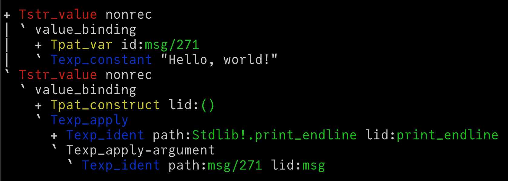

## Synopsis



## Building

```
opam switch create . --empty
eval $(opam env --switch=. --set-switch)
opam pin add ocaml-variants git+https://github.com/clef-men/ocaml#atomic_fields_11 --yes
opam install . --deps-only --yes
make
```
